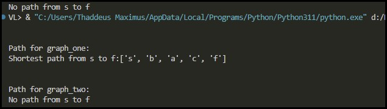
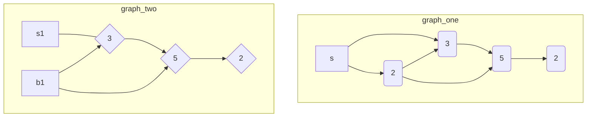

# PE07: Programming Exercise

- [PE07: Programming Exercise](#pe07-programming-exercise)
  - [Instructions](#instructions)
    - [Description](#description)
    - [Documentation reference](#documentation-reference)
    - [Expected result](#expected-result)
    - [Summary](#summary)
    - [Screenshot](#screenshot)
  - [Graph Structure](#graph-structure)
    - [Graph One - Directed Edges](#graph-one---directed-edges)
    - [Graph Two - Undirected Edges](#graph-two---undirected-edges)
  - [Execution](#execution)
  - [Sample Tests](#sample-tests)

## Instructions

- `dijkstra_main.py`
- `dijkstra.py`

### Description

This assignment is to learn about the Dijkstra algorithm. Given a hash graph map from the dijkstra_main.py, complete the functions in the separate "DijkstraClass" class within dijkstra.py. The main object of the "DijkstraClass" is to find the lowest-cost path from the start (s) to finish (f). Note that "dijkstra_main.py" with the "main" method and starter file "dijkstra.py" with class has already been provided (download attachment).

As part of the assignment, describe how the Dijkstra algorithm works in your own words. Keep in mind to always comment and document your class and methods.

### Documentation reference

[Mertz, J. (n.d.). Documenting Python Code: A Complete Guide.](https://realpython.com/documenting-python-code/)

### Expected result

1. `dijkstra_main.py`
    - This is the Main python file that is already provided and contains the main and test procedure, which calls methods implemented on "dijkstra.py" (this is already provided, but please include this file in your submission).
2. `dijkstra.py`
    - This class contains such methods as init, initial_costs_parents, find_shorted_path, find_lowest_cost_node, and print_path. Please keep in mind the following notes for each method during implementation:
    - `init()`: this method has already been provided.
    - `initial_costs_parents()`: this method initializes costs and parents global variables as to how the Dijkstra algorithm works.
    - `find_shorted_path()`: this method updates costs and parents global variables by following the Dijkstra algorithm.
    - `find_lowest_cost_node (costs)`: this method finds and returns the lowest cost node that hasn't been processed yet.
3. **Parameters**: _costs_
    - `print_path()`: if there is path, prints path from `s` to `f`

### Summary

As part of the assignment, describe how the Dijkstra algorithm works in your own words.

---

Dijkstra's algorithm, developed by Edsger Dijkstra, is a method used to find the shortest path between nodes in a graph. The algorithm starts at a chosen `start node` and analyzes its immediate neighbors, calculating the tentative distances to them. It keeps track of the smallest value, representing the `shortest path`. The algorithm then moves to the `node` with the smallest recorded distance, marks it as "**visited**", and reassesses its non-visited neighbors, recalculating their tentative distances. This process continues until all nodes have been visited, determining the shortest path from the start node to every other node.

It's important to note that Dijkstra's algorithm assumes all edge weights in the graph are non-negative. It cannot reliably find the shortest path if there are negative edges.

### Screenshot



## Graph Structure

This Mermaid file visualizes the graph connections and costs.
The numbers next to the edges represent the costs to reach the connected nodes.

### Graph One - Directed Edges

In graph_one, the nodes `s`, `a`, `b`, `c`, and `f` are connected with directed edges.



### Graph Two - Undirected Edges

In graph_two, the nodes `s`, `a`, `b`, `c`, and `f` are also connected, but there are no costs associated with the edges.


## Execution

In the dijkstra_main.py file, the main function is defined to demonstrate the usage of the DijkstraClass.
To run the code, execute `dijkstra_main.py`. It will output the shortest paths for both graph_one and graph_two.

1. It initializes the example graphs
    - `graph_one`
    - `graph_two`
2. Then finds the lowest-cost path from:
    - the start node (`s`) to
    - the finish node (`f`)
3. Using the `DijkstraClass` instance
4. The `print_path` method is called on each instance to print the shortest path

## Sample Tests

```python
from dijkstra import DijkstraClass

def test_shortest_path():
    graph = {
        'A': {'B': 1, 'C': 4},
        'B': {'A': 1, 'C': 2, 'D': 5},
        'C': {'A': 4, 'B': 2, 'D': 1},
        'D': {'B': 5, 'C': 1}
    }
    dijkstra = DijkstraClass(graph)
    dijkstra.print_path('A', 'D')
    # Add assertions to check the correctness of the result
    # For example:
    # assert dijkstra.costs['D'] == 3
    # assert dijkstra.parents['D'] == 'C'

def test_no_path():
    graph = {
        'A': {'B': 1},
        'B': {'C': 2},
        'C': {},
        'D': {'E': 3},
        'E': {'F': 4},
        'F': {}
    }
    dijkstra = DijkstraClass(graph)
    dijkstra.print_path('A', 'F')
    # Add assertions to check the correctness of the result
    # For example:
    # assert dijkstra.costs['F'] == float('inf')
    # assert dijkstra.parents['F'] is None
```
