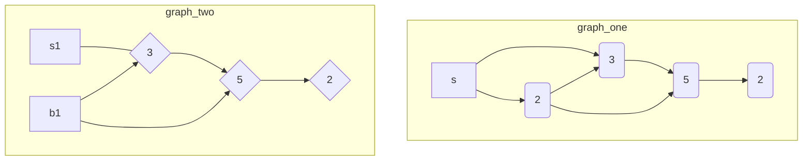

# PE07: Programming Exercise

- [PE07: Programming Exercise](#pe07-programming-exercise)
  - [Instructions](#instructions)
    - [Description](#description)
    - [Documentation reference](#documentation-reference)
    - [Expected result](#expected-result)
    - [Summary](#summary)
    - [Screenshot](#screenshot)
  - [Graph Structure](#graph-structure)
    - [Graph One - Directed Edges](#graph-one---directed-edges)
    - [Graph Two - Undirected Edges](#graph-two---undirected-edges)
  - [Execution](#execution)
  - [Sample Tests](#sample-tests)
  - [Dijkstra](#dijkstra)

## Instructions

- `dijkstra_main.py`
- `dijkstra.py`

### Description

This assignment is to learn about the Dijkstra algorithm. Given a hash graph map from the dijkstra_main.py, complete the functions in the separate "DijkstraClass" class within dijkstra.py. The main object of the "DijkstraClass" is to find the lowest-cost path from the start (s) to finish (f). Note that "dijkstra_main.py" with the "main" method and starter file "dijkstra.py" with class has already been provided (download attachment).

As part of the assignment, describe how the Dijkstra algorithm works in your own words. Keep in mind to always comment and document your class and methods.

### Documentation reference

[Mertz, J. (n.d.). Documenting Python Code: A Complete Guide.](https://realpython.com/documenting-python-code/)

### Expected result

1. `dijkstra_main.py`
    - This is the Main python file that is already provided and contains the main and test procedure, which calls methods implemented on "dijkstra.py" (this is already provided, but please include this file in your submission).
2. `dijkstra.py`
    - This class contains such methods as init, initial_costs_parents, find_shorted_path, find_lowest_cost_node, and print_path. Please keep in mind the following notes for each method during implementation:
    - `init()`: this method has already been provided.
    - `initial_costs_parents()`: this method initializes costs and parents global variables as to how the Dijkstra algorithm works.
    - `find_shorted_path()`: this method updates costs and parents global variables by following the Dijkstra algorithm.
    - `find_lowest_cost_node (costs)`: this method finds and returns the lowest cost node that hasn't been processed yet.
3. **Parameters**: _costs_
    - `print_path()`: if there is path, prints path from `s` to `f`

### Summary

As part of the assignment, describe how the Dijkstra algorithm works in your own words.

---

Dijkstra's algorithm, developed by Edsger Dijkstra, is a method used to find the shortest path between nodes in a graph. The algorithm starts at a chosen `start node` and analyzes its immediate neighbors, calculating the tentative distances to them. It keeps track of the smallest value, representing the `shortest path`. The algorithm then moves to the `node` with the smallest recorded distance, marks it as "**visited**", and reassesses its non-visited neighbors, recalculating their tentative distances. This process continues until all nodes have been visited, determining the shortest path from the start node to every other node.

It's important to note that Dijkstra's algorithm assumes all edge weights in the graph are non-negative. It cannot reliably find the shortest path if there are negative edges.

### Screenshot


## Graph Structure

This Mermaid file visualizes the graph connections and costs.
The numbers next to the edges represent the costs to reach the connected nodes.

### Graph One - Directed Edges

In graph_one, the nodes `s`, `a`, `b`, `c`, and `f` are connected with directed edges.



### Graph Two - Undirected Edges

In graph_two, the nodes `s`, `a`, `b`, `c`, and `f` are also connected, but there are no costs associated with the edges.


## Execution

In the dijkstra_main.py file, the main function is defined to demonstrate the usage of the DijkstraClass.
To run the code, execute `dijkstra_main.py`. It will output the shortest paths for both graph_one and graph_two.

1. It initializes the example graphs
    - `graph_one`
    - `graph_two`
2. Then finds the lowest-cost path from:
    - the start node (`s`) to
    - the finish node (`f`)
3. Using the `DijkstraClass` instance
4. The `print_path` method is called on each instance to print the shortest path

## Sample Tests

```python
from dijkstra import DijkstraClass

def test_shortest_path():
    graph = {
        'A': {'B': 1, 'C': 4},
        'B': {'A': 1, 'C': 2, 'D': 5},
        'C': {'A': 4, 'B': 2, 'D': 1},
        'D': {'B': 5, 'C': 1}
    }
    dijkstra = DijkstraClass(graph)
    dijkstra.print_path('A', 'D')
    # Add assertions to check the correctness of the result
    # For example:
    # assert dijkstra.costs['D'] == 3
    # assert dijkstra.parents['D'] == 'C'

def test_no_path():
    graph = {
        'A': {'B': 1},
        'B': {'C': 2},
        'C': {},
        'D': {'E': 3},
        'E': {'F': 4},
        'F': {}
    }
    dijkstra = DijkstraClass(graph)
    dijkstra.print_path('A', 'F')
    # Add assertions to check the correctness of the result
    # For example:
    # assert dijkstra.costs['F'] == float('inf')
    # assert dijkstra.parents['F'] is None
```

## Dijkstra

`dijkstra.py` implements Dijkstra's algorithm for finding the shortest path in a graph. It defines a class called DijkstraClass which encapsulates the algorithm. The class has methods to initialize the graph, find the shortest path, and print the path. The graph is expected to be a dictionary where each key is a node, and the value is another dictionary representing the neighboring nodes and the cost to reach them.

`dijkstra_main.py` is the main program that demonstrates the usage of the DijkstraClass. It defines two example graphs (graph_one and graph_two) and finds the lowest-cost path from the start node (s) to the finish node (f) using the DijkstraClass. The paths are then printed.

To run the code, you need to execute `dijkstra_main.py`. It will output the shortest paths for both graph_one and graph_two.

```python
"""dijkstra.py

Summary:
This module implements Dijkstra's algorithm for finding the shortest path in a graph.

Extended Summary:
Dijkstra's algorithm is a graph search algorithm that solves the shortest-path problem for a graph
with non-negative edge path costs, producing a shortest path tree. This class provides an
encapsulation of Dijkstra's algorithm with helper functions to compute and print the shortest path
in a graph.

Returns:
    DijkstraClass: A class that encapsulates the Dijkstra's algorithm.
"""
from typing import Dict, Optional

class DijkstraClass:
    """
    A class that encapsulates Dijkstra's algorithm for finding the shortest path in a graph.

    The graph is expected to be a dictionary where each key is a node, and the value is
    another dictionary representing the neighboring nodes and the cost to reach them.
    For example:

    graph = {
        'A': {'B': 1, 'C': 4},
        'B': {'A': 1, 'C': 2, 'D': 5},
        'C': {'A': 4, 'B': 2, 'D': 1},
        'D': {'B': 5, 'C': 1}
    }
    """

    def __init__(self, graph: Dict[str, Dict[str, int]]) -> None:
        """Initializes the DijkstraClass with a given graph.

        Args:
            graph (dict): The graph in which to find the shortest path, represented as a dictionary.

        Raises:
            ValueError: If the input graph is not valid.
        """
        if not isinstance(graph, Dict):
            raise ValueError("Input graph must be a dictionary.")

        for node, edges in graph.items():
            if not isinstance(node, str) or not isinstance(edges, Dict):
                raise ValueError("Graph must be a dictionary of dictionaries.")

        self.graph: Dict[str, Dict[str, int]] = graph
        self.infinity = float("inf")
        self.costs: dict = {}
        self.parents: dict = {}
        self.processed: list = []


    def initial_costs_parents(self, start: str) -> None:
        """
        Initializes the costs and parents dictionaries for the start of the algorithm.

        Raises:
            ValueError: If the start node is not in the graph.
        """
        if start not in self.graph:
            raise ValueError("Start node must be in the graph.")

        for node in self.graph:
            if node == start:
                self.costs[node] = 0
            else:
                self.costs[node] = self.infinity
            self.parents[node] = None


    def find_shortest_path(self, start: str, end: str) -> None:
        """
        Applies Dijkstra's algorithm to find the shortest path in the graph.

        Args:
            start (str): The node from which to start the search.
            end (str): The node to which to find the path.

        Raises:
            ValueError: If the start or end node is not in the graph.
        """
        if start not in self.graph or end not in self.graph:
            raise ValueError("Both start and end nodes must be in the graph.")

        self.initial_costs_parents(start)
        node = start
        while node is not None:
            cost = self.costs[node]
            neighbors: Dict[str, int] = self.graph[node]
            for i in neighbors.keys():
                new_cost = cost + neighbors[i]
                if i not in self.costs or new_cost < self.costs[i]:
                    self.costs[i] = new_cost
                    self.parents[i] = node
            self.processed.append(node)
            node: str | None = self.find_lowest_cost_node(self.costs)


    def find_lowest_cost_node(self, costs: Dict[str, int]) -> Optional[str]:
        """
        Finds the unprocessed node with the lowest known cost.

        Args:
            costs (dict): A dictionary of the current cost to reach each node.

        Returns:
            Optional[str]: The unprocessed node with the lowest known cost,
                            or None if there are no unprocessed nodes.
        """
        lowest_cost = self.infinity
        lowest_cost_node = None
        for node in costs:
            cost: int = costs[node]
            if cost < lowest_cost and node not in self.processed:
                lowest_cost: int = cost
                lowest_cost_node: str = node
        return lowest_cost_node


    def print_path(self, start: str, end: str) -> None:
        """
        Prints out the shortest path computed by the algorithm from start node to end node.
        If no path exists, prints an appropriate message.

        Args:
            start (str): The start node of the path.
            end (str): The end node of the path.
        """
        self.find_shortest_path(start, end)

        node: str = end
        path: list = []
        while node is not None:
            path.append(node)
            node = self.parents.get(node, None)

        if len(path) == 1 and path[0] == end:
            print(f"No path from {start} to {end}")
        else:
            path.reverse()
            print(f"Shortest path from {start} to {end}:{path}")


"""dijkstra_main.py

This assignment is to learn about the Dijkstra algorithm.
Given a hash graph map from the dijkstra_main.py, complete the functions
in the separate "DijkstraClass" class within dijkstra.py.
The main object of the "DijkstraClass" is to find the lowest-cost path
from the start (s) to finish (f).
"""
from typing import Dict
from src.dijkstra import DijkstraClass

graph_one: Dict[str, Dict[str, int]] = {
    "s": {"a": 6, "b": 2},
    "a": {"c": 1},
    "b": {"a": 3, "c": 5},
    "c": {"f": 2},
    "f": {},
}

graph_two: Dict[str, Dict[str, int]] = {
    "s": {},
    "a": {"c": 1},
    "b": {"a": 3, "c": 5},
    "c": {"f": 2},
    "f": {},
}


def main():
    start_node = "s"
    end_node = "f"

    print("Path for graph_one:")
    dij_one = DijkstraClass(graph_one)
    dij_one.print_path(start_node, end_node)

    print("Path for graph_two:")
    dij_two = DijkstraClass(graph_two)
    dij_two.print_path(start_node, end_node)


if __name__ == "__main__":
    main()
```
